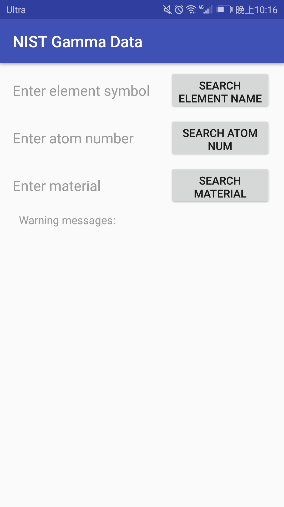
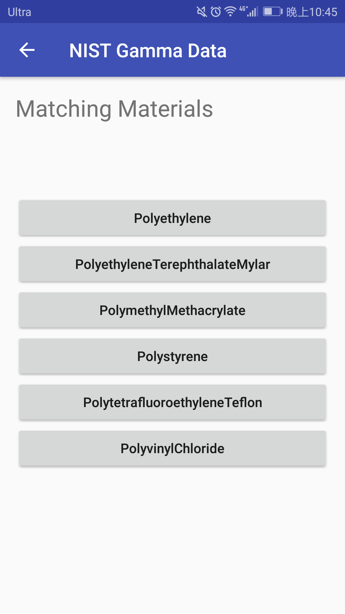
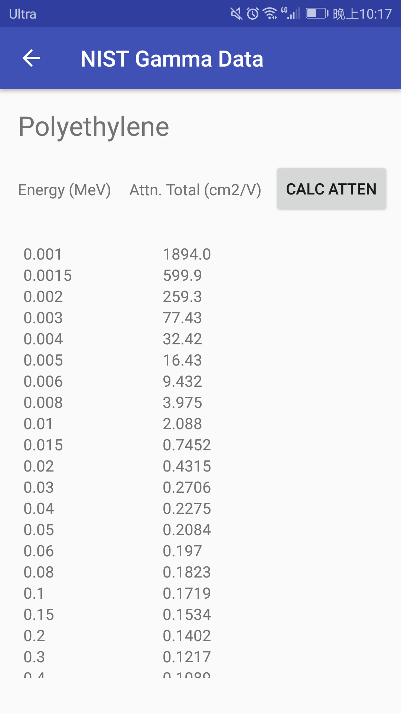
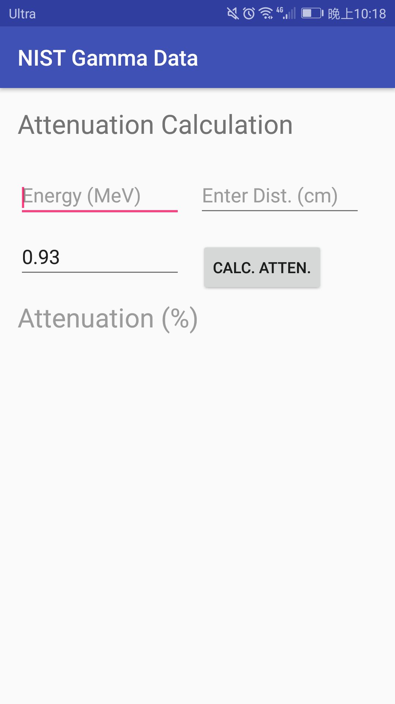

# NIST Gamma Data
NIST Gamma Data is an Android application to search Gamma ray attenuation data from locally saved NIST database.

The advantage over the original website is:
	(Of course) offline data accessary;
	Faster approach;
	Most importantly, it can search for the best shielding material based on user specification!

Currently the user can query any elements between Hydrogen and Uranium. Also quite a few materials are ready for query (e.g. bone, poly, concrete ...).

Any feedback is appreciated! If you liked this please click "star" on the upper right corner :)

## Getting Started

### Release version path
See app/build/outputs/apk/release/app-release-unsigned.apk for current version.

### Prerequisites (of Android version) to install the apk
Android 4.0 (remains to be verified)

### Tutorial
The UI of this app is very simple. When the app is opened the user is prompted with three options (case-insensitive):
	1) search element by name/symbol (e.g. "H" or "Hydrogen")
	2) search element by atom number
	3) search material by partial/full name (e.g. "poly" or "polyethylene")
If a partial name is entered to search for a material there might be several options to choose from.

 
Once an element/material is chosen, the element/material's total attenuation vs. energy will be shown in list-mode data.
The user can also query the attenuation (%) of gamma rays between 1 keV and 20 MeV for any element/material in the database by clicking the button "CALC ATTEN". The density is already loaded!

 

### Prerequisites for building
[Android Studio](https://developer.android.com/studio/install.html) is needed.

### Built With
- Java
- [SQLite](https://www.sqlite.org/) - Data management

## Version
### Version 0.1
Added basic elements and materials. User can search for (1) an element using atom number/symbol/full name and (2) a material using full name/partial name. The searching is not case-sensitive.
The attenuation coefficient is displayed in a listmode. The user can then calculate the attenuation by clicking "Calc. Atten." button and input the desired gamma ray energy at an arbitrary distance.

## Authors
- Jiawei Xia

## Acknowledgements
All the NIST files are fetched from:
https://physics.nist.gov/PhysRefData/Xcom/html/xcom1.html

